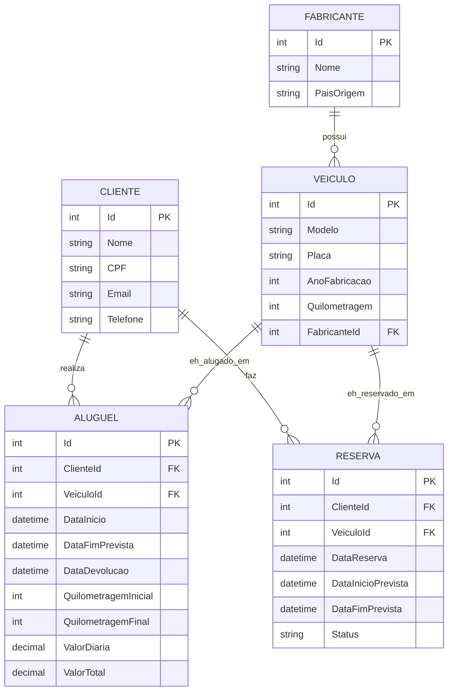

# Modelagem do Banco de Dados — Sistema de Locadora de Veículos

## 1. Entidades e Atributos

### Fabricante
| Atributo | Tipo | Restrição |
|---|---|---|
| Id | int | PK, identity |
| Nome | varchar(100) | obrigatório |
| PaisOrigem | varchar(60) | opcional |

### Veiculo
| Atributo | Tipo | Restrição |
|---|---|---|
| Id | int | PK, identity |
| Modelo | varchar(60) | obrigatório |
| Placa | varchar(10) | obrigatório, único |
| AnoFabricacao | int | obrigatório |
| Quilometragem | int | obrigatório |
| FabricanteId | int | FK → Fabricante, obrigatório |

### Cliente
| Atributo | Tipo | Restrição |
|---|---|---|
| Id | int | PK, identity |
| Nome | varchar(120) | obrigatório |
| CPF | varchar(14) | obrigatório, único |
| Email | varchar(120) | obrigatório, único |
| Telefone | varchar(20) | opcional |

### Aluguel
| Atributo | Tipo | Restrição |
|---|---|---|
| Id | int | PK, identity |
| ClienteId | int | FK → Cliente, obrigatório |
| VeiculoId | int | FK → Veiculo, obrigatório |
| DataInicio | datetime | obrigatório |
| DataFimPrevista | datetime | obrigatório |
| DataDevolucao | datetime | opcional (nulo até a devolução) |
| QuilometragemInicial | int | obrigatório |
| QuilometragemFinal | int | opcional (preenchido na devolução) |
| ValorDiaria | decimal(10,2) | obrigatório |
| ValorTotal | decimal(10,2) | opcional (calculado na devolução) |

### Reserva (5ª entidade)
| Atributo | Tipo | Restrição |
|---|---|---|
| Id | int | PK, identity |
| ClienteId | int | FK → Cliente, obrigatório |
| VeiculoId | int | FK → Veiculo, obrigatório |
| DataReserva | datetime | obrigatório |
| DataInicioPrevista | datetime | obrigatório |
| DataFimPrevista | datetime | obrigatório |
| Status | varchar(20) | obrigatório (Pendente / Confirmada / Cancelada) |

## 2. Relacionamentos

- **Fabricante (1) → Veiculo (N)**: um fabricante possui vários veículos; todo veículo pertence a exatamente um fabricante.
- **Cliente (1) → Aluguel (N)**: um cliente pode ter vários aluguéis ao longo do tempo.
- **Veiculo (1) → Aluguel (N)**: um veículo pode ser alugado várias vezes (em períodos distintos).
- **Cliente (1) → Reserva (N)**: um cliente pode fazer várias reservas.
- **Veiculo (1) → Reserva (N)**: um veículo pode ter várias reservas.

Todos os relacionamentos são **1:N**, implementados via chave estrangeira na tabela do lado "N", com `DeleteBehavior.Restrict` (não é permitido excluir um registro "pai" que possua "filhos" vinculados, evitando exclusões em cascata indesejadas).

## 3. Diagrama Entidade-Relacionamento

> O diagrama acima está em formato Mermaid. Ele é renderizado automaticamente no GitHub (basta visualizar este arquivo `.md` no repositório) e também no VS Code com a extensão "Markdown Preview Mermaid Support".

## 4. Tradução para o banco relacional (Entity Framework — Code First)

O modelo conceitual acima foi traduzido para um esquema relacional através do **Entity Framework Core**, utilizando a abordagem *Code First*:

- As classes de entidade estão em `LocadoraVeiculos.API/Models/`.
- O mapeamento (chaves primárias, estrangeiras, índices únicos e tipos de coluna) está centralizado em `LocadoraVeiculos.API/Data/LocadoraContext.cs`, através da Fluent API.
- O esquema físico é gerado a partir das *Migrations* do EF Core (ver instruções no `README.md` da raiz do projeto).
